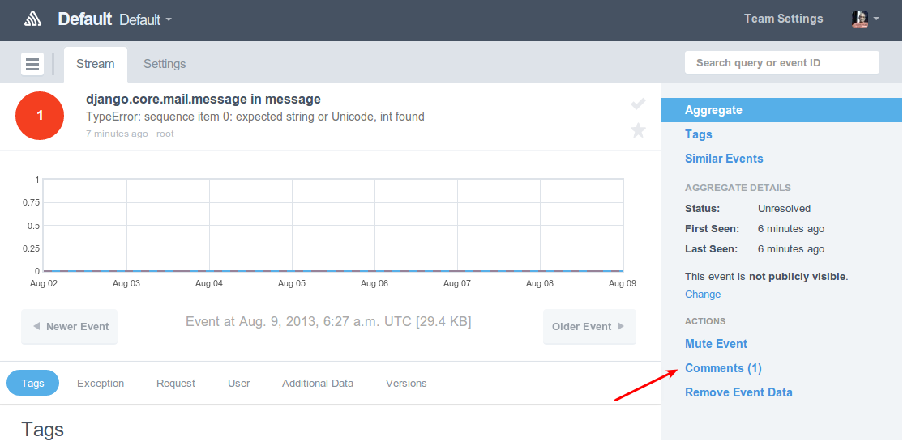
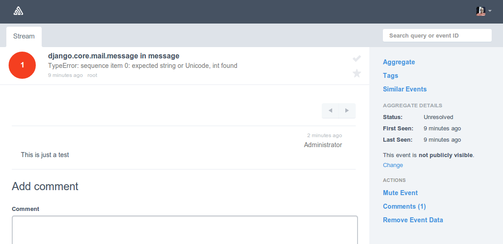

.. sentry-comments documentation master file, created by
   sphinx-quickstart on Sun Nov 25 10:43:59 2012.
   You can adapt this file completely to your liking, but it should at least
   contain the root `toctree` directive.

Welcome to sentry-comments's documentation!
===========================================

sentry-comments is an extension for Sentry to add comments to events.

Comments show up within a new panel on the event page:

The comments panel:

Installation
------------

To install the comments extension run::

  pip install sentry-comments

After restarting Sentry you need to enable the plugin for each project on the
project's setting page. A new comments panel appears on the event page. Click
on the panel title to read or add comments.

Configuration
-------------

To receive email notification about new comments go to the plugin
settings. By default the comments plugin doesn't send email
notifications.

Resources
---------

Bug tracker
  https://github.com/andialbrecht/sentry-comments/issues

Source code
  https://github.com/andialbrecht/sentry-comments

Documentation
  https://sentry-comments.readthedocs.org/

License
-------

sentry-comments is licensed under the BSD license.

.. include:: ../LICENSE

.. Contents:

.. .. toctree::
..    :maxdepth: 2

.. Indices and tables
.. ==================

.. * :ref:`genindex`
.. * :ref:`modindex`
.. * :ref:`search`

